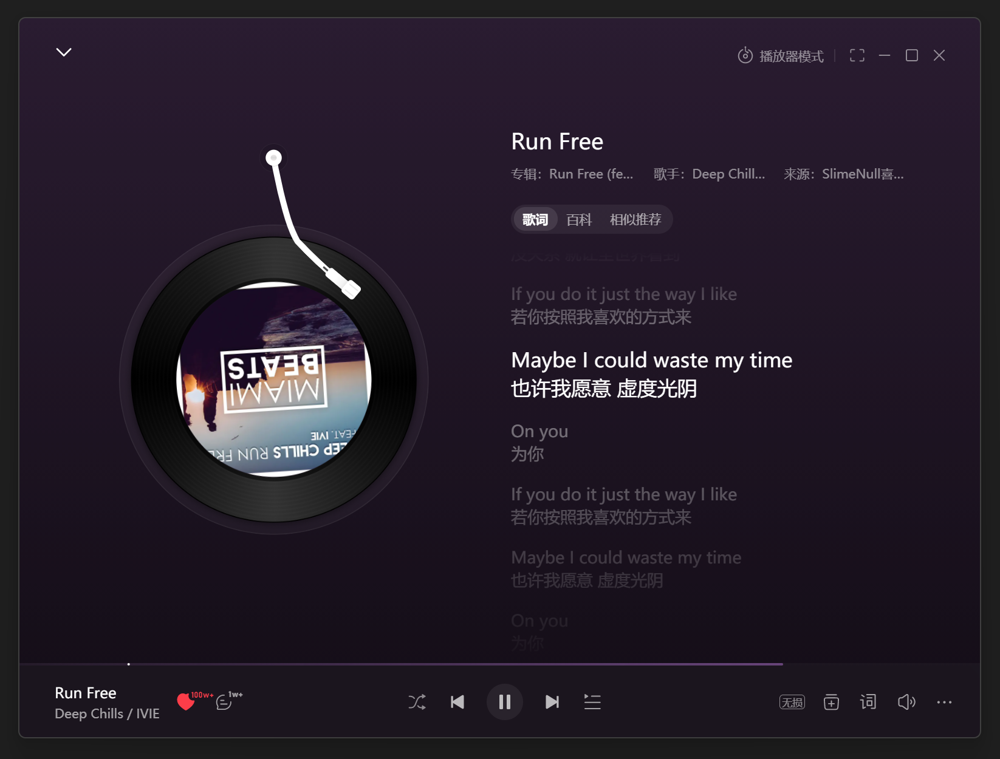

# 一页限制滚动 Demo

众所周知, 网易云 PC 端(浏览器套壳版本)的播放页滚动体验极其差劲.

其功能大致如下:

1. 页面分为播放主页面(上面的图)以及评论区
2. 当处于主页面的时候, 用户滚动鼠标界面会上下滚动, 但没有缓动.
3. 当用户向下滚动的偏移不足页面一半时, 在停止滚动后一定时间(约莫几百毫秒), 会重新回到初始位置, 这一操作是有缓动的, 只不过其缓动曲线也极其生硬.
4. 当用户向下滚动的偏移大于页面一半时, 软件会缓动到评论区. 在评论区内滚动是带有缓动.
5. 从评论区向上滚动到播放主页面时, 也没有缓动. 并且在松开鼠标, 滚动偏移不足页面一半时, 也会重新回到评论区的初始状态.

此仓库包含与网易云上述滚动功能近似的实现, 且滚动体验要更好.

https://github.com/user-attachments/assets/6a36d297-974a-4aeb-ad06-3a792aaec7b1

> bilibili 视频 https://www.bilibili.com/video/BV15ufYBaE49/
